# 🔍 Snowpark DB-API Call Explanation

## Overview
This document explains the **exact DB-API call** and abstraction layers used in our Snowpark data transfer solution for project management visibility.

## 🎯 The Core DB-API Call

The **actual Snowflake DB-API call** that performs data transfer:

```python
df = self.session.read.dbapi(
    self.connection_factory,           # SQL Server connection function
    query=actual_query,               # "SELECT TOP 25 * FROM dbo.your_table"  
    fetch_size=self.config.transfer.fetch_size,    # 1000 rows per batch
    query_timeout=self.config.transfer.query_timeout,  # 300 seconds  
    max_workers=self.config.transfer.max_workers,      # 4 parallel workers
    custom_schema=custom_schema       # Our auto-generated StructType schema
)
```

**Location:** `snowpark_db_api/core.py` lines 128-132

## 🏗️ Abstraction Layer Breakdown

### 1. Configuration → SQL Query Translation

**User Input (Notebook/CLI):**
```python
SOURCE_TABLE = 'dbo.your_table'
limit_rows = 25
```

**Generated SQL Query:**
```python
actual_query = "SELECT TOP 25 * FROM dbo.your_table"
```

**Code Location:** `_build_transfer_query()` method, lines 174-176

### 2. Schema Generation Process

**Step 1: Query SQL Server Metadata**
```sql
SELECT COLUMN_NAME, DATA_TYPE, CHARACTER_MAXIMUM_LENGTH, 
       NUMERIC_PRECISION, NUMERIC_SCALE, IS_NULLABLE
FROM INFORMATION_SCHEMA.COLUMNS 
WHERE TABLE_SCHEMA = 'dbo' AND TABLE_NAME = 'your_table'
ORDER BY ORDINAL_POSITION
```

**Step 2: Convert to Snowpark StructType**
```python
custom_schema = StructType([
    StructField("Column1", StringType(), True),
    StructField("Column2", IntegerType(), False),
    StructField("Column3", DecimalType(10,2), True),
    # ... 100+ more columns mapped from SQL Server types
])
```

**Code Location:** `_get_table_schema()` method, lines 188-265

### 3. Connection Management

**SQL Server Connection Factory:**
```python
self.connection_factory  # Returns: pyodbc connection to SQL Server
```

**Snowflake Session:**
```python
self.session  # Snowpark Session connected to Snowflake
```

### 4. Data Write Operation

**Write to Snowflake:**
```python
write_result = df.write.mode("overwrite").save_as_table("DB_MSSQL_CLEAN_test")
```

## 🔄 Complete Execution Flow

```mermaid
graph TD
    A[User Config] --> B[Generate SQL Query]
    B --> C[Query SQL Server Schema]
    C --> D[Create Snowpark StructType]
    D --> E[Execute DB-API Call]
    E --> F[SQL Server Data → DataFrame]
    F --> G[Write DataFrame to Snowflake]
    G --> H[Transfer Complete]
```



### Detailed Steps:

1. **Schema Discovery** → Query SQL Server `INFORMATION_SCHEMA.COLUMNS`
2. **Type Mapping** → Convert SQL Server types to Snowpark types
3. **Query Execution** → Run `SELECT TOP X` on SQL Server via DB-API
4. **Data Transfer** → Stream data through Snowpark DataFrame
5. **Snowflake Write** → Save as table in Snowflake

## 📊 What the PM Can Monitor

### Log Output Examples:

```
2025-07-02 01:44:32 - INFO - Transfer query: SELECT TOP 25 * FROM dbo.your_table
2025-07-02 01:44:32 - INFO - Generated schema with 106 columns
2025-07-02 01:44:33 - INFO - 🚀 Transferring 25 rows
2025-07-02 01:44:33 - INFO - 💾 Memory usage - Before: 245.3MB, After: 248.1MB, Used for count(): 2.8MB
2025-07-02 01:44:33 - INFO - 🔧 Batch size: 1000 rows/batch, Workers: 4
2025-07-02 01:44:34 - INFO - 💾 Data transfer memory - Before: 248.1MB, After: 251.4MB, Used: 3.3MB
2025-07-02 01:44:34 - INFO - Writing data to Snowflake table: your_destination_table
```

### Performance Parameters:

| Parameter | Value | Purpose |
|-----------|-------|---------|
| `fetch_size` | 1000 | Rows per batch from SQL Server |
| `max_workers` | 4 | Parallel processing threads |
| `query_timeout` | 300s | Max time per query |
| `custom_schema` | Auto-generated | Avoids schema inference issues |

### Configuration Visibility:

- **Source Database:** `your-server.database.windows.net`
- **Source Table:** `dbo.your_table` (example: large table with many columns)
- **Target:** `your_account.your_database.PUBLIC.table_name`
- **Transfer Mode:** `overwrite` or `append`

## 🎯 Key Technical Decisions

### Why Custom Schema Generation?
- **Problem:** Snowpark's auto-inference wraps queries in additional SELECT statements
- **Issue:** `SELECT * FROM SELECT TOP 25 * FROM table` = Invalid SQL
- **Solution:** Pre-generate schema to skip inference entirely

### Why DB-API vs Direct SQL?
- **Advantage:** Handles connection pooling, retries, and optimization
- **Benefit:** Built-in parallel processing and batch handling
- **Result:** Better performance for large datasets

## 💾 Memory Management & Lazy Evaluation

### How We Ensure the DataFrame Doesn't Load All Data:

**1. Lazy Evaluation:**
```python
df = session.read.dbapi(...)  # Creates query plan - NO DATA LOADED
row_count = df.count()        # Executes count query only 
df.write.save_as_table(...)   # Streams data in controlled batches
```

**2. Controlled Batch Processing:**
- `fetch_size=1000` → Only 1000 rows in memory at once
- Data streams from SQL Server → Snowflake in small chunks
- Total memory usage stays constant regardless of table size

**3. Memory Monitoring:**
- **Before count():** ~245MB baseline memory
- **After count():** ~248MB (+2.8MB for counting 25 rows)  
- **After transfer:** ~251MB (+3.3MB for streaming 25 rows)
- **Key Point:** Memory usage is proportional to `fetch_size`, NOT total rows

### Lazy vs Eager Operations:

| Operation | Type | Memory Impact |
|-----------|------|---------------|
| `session.read.dbapi()` | Lazy | ~0MB (just query plan) |
| `df.count()` | Action | ~2-5MB (count operation) |
| `df.save_as_table()` | Action | ~fetch_size worth of data |

**Bottom Line:** Even with 30M row tables, memory usage stays under control!

## 🔧 Debugging & Troubleshooting

### Key Log Messages to Watch:

- `✅ Connection successful` → SQL Server connectivity verified
- `Generated schema with X columns` → Schema discovery completed  
- `🚀 Transferring X rows` → Data transfer started
- `Transfer completed successfully` → End-to-end success

### Common Issues:

1. **Schema Inference Errors** → Solved with custom schema
2. **Password Escaping** → Solved with environment variables
3. **Wide Table Performance** → Monitor with smaller row limits first

## 📋 Summary

**Bottom Line:** The system uses Snowflake's `session.read.dbapi()` as the core engine, but we control:

- ✅ **Exact SQL queries** generated and executed
- ✅ **Schema mapping** from SQL Server to Snowflake types  
- ✅ **Performance parameters** (batch size, parallelism, timeouts)
- ✅ **Connection management** and error handling

All abstraction layers are **transparent and loggable** for PM visibility and debugging. 