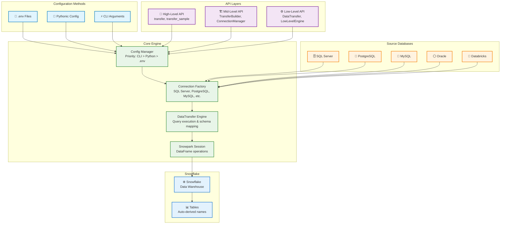

# 🚀 Snowpark DB-API: Layered Architecture with Flexible Configuration


**Professional data transfer tool for Snowflake with multiple configuration approaches and a clean layered API architecture.**

## ⚠️ **Testing Status & Database Support**

| Database Type | Support Status | Testing Status |
|---------------|----------------|----------------|
| **SQL Server** | ✅ Full Support | ✅ **Extensively Tested** |
| **PostgreSQL** | 🔧 Code Support | ⚠️ **Needs Testing** |
| **Oracle** | 🔧 Code Support | ⚠️ **Needs Testing** |
| **Databricks** | 🔧 Code Support | ⚠️ **Needs Testing** |

**🚨 Important:** This library has been **extensively tested and validated only with SQL Server**. While the code includes support for PostgreSQL, MySQL, Oracle, and Databricks, these database types have **not been tested** in real-world scenarios.

**If you plan to use non-SQL Server databases:**
- 🧪 **Test thoroughly** with small datasets first
- 🐛 **Expect potential issues** with connection strings, data types, or SQL syntax
- 🤝 **Contributions welcome** - help us test and improve support for other databases
- 📝 **Report issues** if you encounter problems with non-SQL Server databases

---

## 🎯 Three Ways to Configure: Pick Your Style!

We support **three different configuration approaches** - use whichever fits your workflow:

| Method | Best For | Example |
|--------|----------|---------|
| **📄 .env Files** | Local development, simple projects | `DB_HOST=server.com` |
| **🐍 Pythonic Config** | Complex apps, type safety, IDE support | `Config(source=SourceConfig(...))` |
| **⚡ CLI Commands** | Automation, CI/CD, one-off tasks | `--source-host server.com` |

**Mix and match approaches!** CLI overrides Pythonic, Pythonic overrides .env files.

---

## 🏗️ Architecture Overview



---

## 📄 METHOD 1: .env File Configuration (Recommended for Getting Started)

### 🚀 Quick Start with .env

Create a `.env` file in your project root:

```bash
# === SOURCE DATABASE ===
DB_TYPE=sqlserver
SOURCE_HOST=your-server.database.windows.net
SOURCE_DATABASE=your_database
SOURCE_USERNAME=your_username
SOURCE_PASSWORD=your_password
SOURCE_PORT=1433
SOURCE_TRUSTED_CONNECTION=false

# === SNOWFLAKE ===
SNOWFLAKE_ACCOUNT=your_account.region.cloud
SNOWFLAKE_USER=your_snowflake_user
SNOWFLAKE_PASSWORD=your_snowflake_password
SNOWFLAKE_ROLE=SYSADMIN
SNOWFLAKE_WAREHOUSE=COMPUTE_WH
SNOWFLAKE_DATABASE=your_snowflake_database
SNOWFLAKE_SCHEMA=PUBLIC

# === TRANSFER SETTINGS ===
DESTINATION_TABLE=MY_TABLE
MODE=overwrite
FETCH_SIZE=10000
MAX_WORKERS=4
QUERY_TIMEOUT=600
LOG_LEVEL=INFO
```

Then use it:

```python
from snowpark_db_api import transfer

# All configuration loaded from .env automatically!
transfer("(SELECT * FROM dbo.orders) AS orders_copy")
```

### 🗄️ Database-Specific .env Examples

#### SQL Server
```bash
DB_TYPE=sqlserver
SOURCE_HOST=your-server.database.windows.net
SOURCE_DATABASE=your_database
SOURCE_USERNAME=your_username
SOURCE_PASSWORD=your_password
SOURCE_PORT=1433
SOURCE_TRUSTED_CONNECTION=false
SOURCE_ENCRYPT=true
SOURCE_TRUST_SERVER_CERTIFICATE=false
```

#### PostgreSQL
```bash
DB_TYPE=postgresql
SOURCE_HOST=localhost
SOURCE_DATABASE=mydb
SOURCE_USERNAME=postgres
SOURCE_PASSWORD=password
SOURCE_PORT=5432
SOURCE_SSL_MODE=prefer
```

#### MySQL
```bash
DB_TYPE=mysql
SOURCE_HOST=localhost
SOURCE_DATABASE=mydb
SOURCE_USERNAME=root
SOURCE_PASSWORD=password
SOURCE_PORT=3306
SOURCE_SSL_DISABLED=false
```

#### Oracle
```bash
DB_TYPE=oracle
SOURCE_HOST=localhost
SOURCE_DATABASE=XE
SOURCE_USERNAME=system
SOURCE_PASSWORD=password
SOURCE_PORT=1521
SOURCE_SERVICE_NAME=XE
```

#### Databricks
```bash
DB_TYPE=databricks
SOURCE_HOST=dbc-12345678-90ab.cloud.databricks.com
SOURCE_HTTP_PATH=/sql/1.0/warehouses/abcdef123456789
SOURCE_ACCESS_TOKEN=dapi123456789abcdef
```

### 🌍 Environment-Specific .env Files

#### Development (.env.development)
```bash
# === DEVELOPMENT ENVIRONMENT ===
DB_TYPE=sqlserver
SOURCE_HOST=dev-server.database.windows.net
SOURCE_DATABASE=DevDatabase
SOURCE_USERNAME=dev_user
SOURCE_PASSWORD=dev_password

SNOWFLAKE_ACCOUNT=dev_account
SNOWFLAKE_USER=dev_snowflake_user
SNOWFLAKE_PASSWORD=dev_password
SNOWFLAKE_WAREHOUSE=DEV_WH
SNOWFLAKE_DATABASE=DEV_DB
SNOWFLAKE_SCHEMA=STAGING

# Development settings
MODE=append
FETCH_SIZE=1000
MAX_WORKERS=2
LOG_LEVEL=DEBUG
SAVE_METADATA=true
```

#### Production (.env.production)
```bash
# === PRODUCTION ENVIRONMENT ===
DB_TYPE=sqlserver
SOURCE_HOST=prod-server.database.windows.net
SOURCE_DATABASE=ProdDatabase
SOURCE_USERNAME=prod_user
SOURCE_PASSWORD=${PROD_PASSWORD}  # From environment variable

SNOWFLAKE_ACCOUNT=prod_account.region.cloud
SNOWFLAKE_USER=prod_snowflake_user
SNOWFLAKE_PASSWORD=${SNOWFLAKE_PROD_PASSWORD}
SNOWFLAKE_WAREHOUSE=PROD_WH
SNOWFLAKE_DATABASE=PROD_DB
SNOWFLAKE_SCHEMA=PUBLIC

# Production settings
MODE=overwrite
FETCH_SIZE=50000
MAX_WORKERS=8
LOG_LEVEL=INFO
SAVE_METADATA=false
```

#### Load Environment-Specific Config
```python
import os
from snowpark_db_api import get_config

# Load environment-specific config
env = os.getenv('ENVIRONMENT', 'development')
config = get_config(env_file=f'.env.{env}')

# Use with any API level
from snowpark_db_api import transfer
transfer("dbo.orders", config=config)
```

---

## 🐍 METHOD 2: Pythonic Configuration (Recommended for Production Apps)

### 🏗️ Full Type-Safe Configuration

```python
from snowpark_db_api.config import (
    Config, SourceConfig, SnowflakeConfig, TransferConfig, DatabaseType
)

# Build configuration programmatically with full type safety
config = Config(
    database_type=DatabaseType.SQLSERVER,
    source=SourceConfig(
        host="your-server.database.windows.net",
        database="your_database", 
        username="your_username",
        password="your_password",
        port=1433,
        trusted_connection=False,
        encrypt=True
    ),
    snowflake=SnowflakeConfig(
        account="your_account.region.cloud",
        user="your_snowflake_user",
        password="your_snowflake_password",
        role="SYSADMIN",
        warehouse="COMPUTE_WH",
        database="your_snowflake_database",
        db_schema="PUBLIC"
    ),
    transfer=TransferConfig(
        destination_table="MY_TABLE",
        mode="overwrite",
        fetch_size=10000,
        max_workers=4,
        query_timeout=600,
        save_metadata=False
    ),
    log_level="INFO"
)

# Use with any API level
from snowpark_db_api import transfer
transfer("dbo.orders", config=config)
```

### 🔧 Dynamic Configuration Building

```python
from snowpark_db_api.config import Config, DatabaseType
import os

def build_config_for_environment(env: str) -> Config:
    """Build configuration dynamically based on environment."""
    
    if env == "development":
        return Config(
            database_type=DatabaseType.SQLSERVER,
            source=SourceConfig(
                host="dev-server.database.windows.net",
                database="DevDB",
                username=os.getenv("DEV_DB_USER"),
                password=os.getenv("DEV_DB_PASSWORD")
            ),
            snowflake=SnowflakeConfig(
                account="dev_account.region.cloud",
                user=os.getenv("DEV_SNOWFLAKE_USER"),
                password=os.getenv("DEV_SNOWFLAKE_PASSWORD"),
                warehouse="DEV_WH",
                database="DEV_DB"
            ),
            transfer=TransferConfig(
                mode="append",  # Safe for development
                fetch_size=1000,
                max_workers=2,
                save_metadata=True  # Helpful for debugging
            ),
            log_level="DEBUG"
        )
    
    elif env == "production":
        return Config(
            database_type=DatabaseType.SQLSERVER,
            source=SourceConfig(
                host="prod-server.database.windows.net",
                database="ProdDB",
                username=os.getenv("PROD_DB_USER"),
                password=os.getenv("PROD_DB_PASSWORD"),
                encrypt=True,  # Always encrypt in production
                trust_server_certificate=False
            ),
            snowflake=SnowflakeConfig(
                account="prod_account.region.cloud",
                user=os.getenv("PROD_SNOWFLAKE_USER"),
                password=os.getenv("PROD_SNOWFLAKE_PASSWORD"),
                warehouse="PROD_WH",
                database="PROD_DB",
                create_db_if_missing=False  # Don't auto-create in prod
            ),
            transfer=TransferConfig(
                mode="overwrite",
                fetch_size=50000,  # Higher performance
                max_workers=8,
                query_timeout=1800,  # 30 minutes for large transfers
                save_metadata=False  # No metadata files in production
            ),
            log_level="INFO"
        )
    
    else:
        raise ValueError(f"Unknown environment: {env}")

# Usage
env = os.getenv("ENVIRONMENT", "development")
config = build_config_for_environment(env)

from snowpark_db_api import transfer
transfer("dbo.large_table", config=config)
```

### 🏭 Factory Pattern for Multiple Databases

```python
from snowpark_db_api.config import Config, DatabaseType
from typing import Dict, Any

class ConfigFactory:
    """Factory for creating database-specific configurations."""
    
    @staticmethod
    def create_sqlserver_config(**overrides) -> Config:
        """Create SQL Server configuration with overrides."""
        defaults = {
            "database_type": DatabaseType.SQLSERVER,
            "source": SourceConfig(
                host="your-server.database.windows.net",
                port=1433,
                trusted_connection=False,
                encrypt=True
            )
        }
        return Config(**{**defaults, **overrides})
    
    @staticmethod
    def create_postgresql_config(**overrides) -> Config:
        """Create PostgreSQL configuration with overrides."""
        defaults = {
            "database_type": DatabaseType.POSTGRESQL,
            "source": SourceConfig(
                host="localhost",
                port=5432,
                ssl_mode="prefer"
            )
        }
        return Config(**{**defaults, **overrides})
    
    @staticmethod
    def create_mysql_config(**overrides) -> Config:
        """Create MySQL configuration with overrides."""
        defaults = {
            "database_type": DatabaseType.MYSQL,
            "source": SourceConfig(
                host="localhost",
                port=3306,
                ssl_disabled=False
            )
        }
        return Config(**{**defaults, **overrides})

# Usage examples
factory = ConfigFactory()

# SQL Server config
sqlserver_config = factory.create_sqlserver_config(
    source=SourceConfig(
        host="your-server.database.windows.net",
        database="your_database",
        username="your_username",
        password="your_password"
    )
)

# PostgreSQL config  
postgres_config = factory.create_postgresql_config(
    source=SourceConfig(
        host="postgres.company.com",
        database="analytics",
        username="analyst",
        password="your_password"
    )
)

# Use them
from snowpark_db_api import transfer
transfer("customers", config=sqlserver_config)
transfer("orders", config=postgres_config)
```

### 🔒 Secrets Management Integration

```python
from snowpark_db_api.config import Config, SourceConfig, SnowflakeConfig
import boto3  # For AWS Secrets Manager
import os

def load_config_with_secrets() -> Config:
    """Load configuration with secrets from AWS Secrets Manager."""
    
    # Get secrets
    secrets_client = boto3.client('secretsmanager', region_name='us-west-2')
    
    def get_secret(secret_name: str) -> dict:
        response = secrets_client.get_secret_value(SecretId=secret_name)
        return eval(response['SecretString'])  # In production, use json.loads()
    
    # Load database secrets
    db_secrets = get_secret('prod/database/sqlserver')
    sf_secrets = get_secret('prod/snowflake/credentials')
    
    return Config(
        database_type=DatabaseType.SQLSERVER,
        source=SourceConfig(
            host=db_secrets['host'],
            database=db_secrets['database'],
            username=db_secrets['username'],
            password=db_secrets['password'],
            encrypt=True
        ),
        snowflake=SnowflakeConfig(
            account=sf_secrets['account'],
            user=sf_secrets['user'],
            password=sf_secrets['password'],
            role=sf_secrets['role'],
            warehouse=sf_secrets['warehouse'],
            database=sf_secrets['database']
        ),
        transfer=TransferConfig(
            mode="overwrite",
            fetch_size=25000,
            max_workers=6
        ),
        log_level="INFO"
    )

# Usage
config = load_config_with_secrets()
from snowpark_db_api import transfer
transfer("sensitive_table", config=config)
```

---

## ⚡ METHOD 3: CLI Configuration (Perfect for Automation & CI/CD)

### 🚀 Basic CLI Usage

```bash
# Simple table transfer with all config via command line
python -m snowpark_db_api transfer \
  --source-table dbo.orders \
  --destination-table ORDERS_COPY

# Query-based transfer with auto-derived destination from alias
python -m snowpark_db_api transfer \
  --query "(SELECT order_id, customer_id, order_amount, order_status, last_updated FROM dbo.customer_orders WHERE last_updated > '2024-01-01') AS recent_orders"
```

### 🌍 Environment Variable Support

```bash
# Set common values as environment variables
export SNOWFLAKE_ACCOUNT=your_account.region.cloud
export SNOWFLAKE_USER=your_snowflake_user
export SNOWFLAKE_PASSWORD=your_snowflake_password
export SNOWFLAKE_WAREHOUSE=COMPUTE_WH
export SNOWFLAKE_DATABASE=your_snowflake_database

# Then CLI commands become much shorter
python -m snowpark_db_api transfer \
  --source-table dbo.large_table \
  --limit 1000 \
  --query "(SELECT TOP 1000 * FROM dbo.large_table) AS sample_data"
```

### 🔧 Advanced CLI Options

```bash
# Full control over transfer behavior
python -m snowpark_db_api transfer \
  --source-table dbo.orders \
  --mode overwrite \
  --fetch-size 25000 \
  --max-workers 6 \
  --query-timeout 1800 \
  --log-level DEBUG \
  --save-metadata
```

### 🐳 Docker CLI Examples

```bash

# Run transfer with Docker
docker run --rm --env-file docker.env python -m snowpark_db_api transfer \
  --source-table dbo.customer_orders \
  --query "(SELECT * FROM dbo.customer_orders WHERE last_updated > '2024-01-01') AS recent_customer_orders"
```

### 🚀 CI/CD Pipeline Examples

#### GitHub Actions (COMPLETE EXAMPLE)
```yaml
name: Data Transfer
on:
  schedule:
    - cron: '0 2 * * *'  # Daily at 2 AM

jobs:
  transfer:
    runs-on: ubuntu-latest
    steps:
      - uses: actions/checkout@v3
      
      - name: Run Snowpark Transfer
        run: |
          docker run --rm \
            -e SNOWFLAKE_ACCOUNT=${{ secrets.SNOWFLAKE_ACCOUNT }} \
            -e SNOWFLAKE_USER=${{ secrets.SNOWFLAKE_USER }} \
            -e SNOWFLAKE_PASSWORD=${{ secrets.SNOWFLAKE_PASSWORD }} \
            -e SNOWFLAKE_WAREHOUSE=${{ secrets.SNOWFLAKE_WAREHOUSE }} \
            -e SNOWFLAKE_DATABASE=${{ secrets.SNOWFLAKE_DATABASE }} \
            snowpark-transfer \
            python -m snowpark_db_api transfer \
            --source-table dbo.daily_sales \
            --query "(SELECT * FROM dbo.daily_sales WHERE sale_date = CAST(GETDATE() AS DATE)) AS daily_sales"
```


---

## ⚡ CLI Usage (Quick & Simple)

The fastest way to get started is with the command-line interface:

### 🔧 Setup (One Time)
```bash
# 1. Copy and edit environment file
cp env-example .env
# Edit .env with your database credentials

# 2. Test your connection
python -m snowpark_db_api test-connection
```

### 🚀 Basic Commands

```bash
# List available tables
python -m snowpark_db_api list-tables

# Preview table data
python -m snowpark_db_api preview sales_data --rows 20

# Test custom queries
python -m snowpark_db_api query "SELECT TOP 10 * FROM dbo.orders" --limit 10

# Transfer entire table
python -m snowpark_db_api transfer --source-table dbo.customers

# Transfer with custom query (destination auto-derived from alias)
python -m snowpark_db_api transfer \
  --query "(SELECT * FROM dbo.orders WHERE date >= '2024-01-01') AS recent_orders"
```

### 🔄 Complete CLI Workflow

Here's a typical development session:

```bash
# 1. Verify connection works
python -m snowpark_db_api test-connection

# 2. Explore what data is available
python -m snowpark_db_api list-tables
python -m snowpark_db_api preview customer_orders --rows 50

# 3. Test your query first
python -m snowpark_db_api query \
  "SELECT * FROM customer_orders WHERE status = 'completed'" \
  --limit 100

# 4. Run small test transfer
python -m snowpark_db_api transfer \
  --query "(SELECT TOP 100 * FROM customer_orders) AS test_sample"

# 5. Full production transfer
python -m snowpark_db_api transfer --source-table customer_orders
```

### 🛠️ Configuration Options

The CLI uses your `.env` file automatically, but you can override settings:

```bash
# Generate configuration template
python -m snowpark_db_api config-template --output my-config.yaml

# All commands automatically use .env configuration
# No need to specify connection details repeatedly!
```

---

## 🚀 LAYERED API WITH CONFIGURATION

### 🚀 HIGH-LEVEL API (90% of Users)

All configuration methods work with the high-level API:

```python
# With .env file (automatic)
from snowpark_db_api import transfer
transfer("(SELECT * FROM dbo.orders) AS orders_copy")

# With pythonic config - set environment first, then transfer uses it automatically
from snowpark_db_api.config import Config, SourceConfig, SnowflakeConfig
import os

config = Config(source=SourceConfig(...), snowflake=SnowflakeConfig(...))
# Config gets used automatically when calling transfer()
from snowpark_db_api import transfer
transfer("dbo.customers")

# Testing functions - ALWAYS TEST FIRST!
from snowpark_db_api import transfer_sample
transfer_sample("dbo.huge_table", rows=100)  # Safe testing
```

### 🏗️ MID-LEVEL API (Composable Workflows)

```python
from snowpark_db_api import TransferBuilder

# Uses .env by default, but can override
result = (TransferBuilder()
    .from_source("dbo.sales_data")
    .to_destination("SALES_PROCESSED") 
    .with_config(custom_config)  # Optional config override
    .with_environment("production")  # Load production settings
    .show_pipeline_steps(True)
    .execute())

# Connection management 
from snowpark_db_api import ConnectionManager
manager = ConnectionManager()  # Uses environment config automatically
manager.connect()
status = manager.test_connections()
# Execute transfers with established connections
result = manager.execute_transfer("dbo.my_table") 
manager.close()
```

### ⚙️ LOW-LEVEL API (Complete Control)

```python
from snowpark_db_api import LowLevelTransferEngine
from snowpark_db_api.config import Config

# Full control with any configuration method
config = Config(...)  # Build however you want
engine = LowLevelTransferEngine(config)

# Or load from .env
from snowpark_db_api import get_config
config = get_config()
engine = LowLevelTransferEngine(config)
```

---


## 🧪 TESTING WITH DIFFERENT CONFIGURATIONS

### 🔍 Test Connection Before Transfer

```python
# Method 1: .env file
from snowpark_db_api import get_config
from snowpark_db_api.core import DataTransfer

config = get_config()
transfer = DataTransfer(config)
if transfer.setup_connections():
    print("✅ Connections working!")
else:
    print("❌ Connection failed!")

# Method 2: Pythonic
config = Config(source=SourceConfig(...), snowflake=SnowflakeConfig(...))
transfer = DataTransfer(config)
# ... same test

# Method 3: CLI
python -m snowpark_db_api test-connection \
  --source-host your-server.com \
  --snowflake-account your_account
```


---

## 🐳 DOCKER CONFIGURATION APPROACHES

### 📄 Docker with .env Files

```bash
# Create .env file
cat > .env << EOF
DB_TYPE=sqlserver
SOURCE_HOST=your-server.database.windows.net
# ... rest of config
EOF

# Use with Docker Compose for CLI
docker compose run --rm snowpark-cli python -c "
from snowpark_db_api import transfer
transfer('dbo.orders')
"

# Or use Jupyter for interactive development
docker compose build snowpark-jupyter
docker compose up snowpark-jupyter
# Then browse to http://localhost:8888
```

### 🐍 Docker with Python Config

```bash
# Mount config file
docker run --rm -v $(pwd)/config.py:/app/config.py snowpark-transfer python -c "
import sys
sys.path.append('/app')
from config import get_production_config
from snowpark_db_api import transfer

config = get_production_config()
transfer('dbo.orders', config=config)
"
```

### ⚡ Docker with CLI

```bash
# All configuration via command line
docker run --rm snowpark-transfer \
  python -m snowpark_db_api transfer \
  --db-type sqlserver \
  --source-host your-server.com \
  # ... all other flags
```

---


### 🚨 Common Configuration Issues

#### Issue: "Config not found"
```python
# Solution: Explicitly specify .env file location
from snowpark_db_api import get_config
config = get_config(env_file='/path/to/.env')
```

#### Issue: "Connection failed"
```python
# Solution: Test each connection separately
from snowpark_db_api.core import DataTransfer
config = get_config()
transfer = DataTransfer(config)

# Test source connection
try:
    conn = transfer.source_connection()
    print("✅ Source connection working")
except Exception as e:
    print(f"❌ Source connection failed: {e}")

# Test Snowflake connection  
try:
    transfer.setup_connections()
    print("✅ Snowflake connection working")
except Exception as e:
    print(f"❌ Snowflake connection failed: {e}")
```

#### Issue: "CLI arguments not working"
```bash
# Solution: Check argument format and escaping
python -m snowpark_db_api transfer \
  --query '(SELECT * FROM dbo.test) AS test_data' \  # Use single quotes
  --source-password 'password_with_special_chars!' \  # Escape special chars
  --log-level DEBUG  # Enable debug logging to see what's happening
```

### Jupyter Notebooks (Recommended for Learning & Interactive Development)
```bash
# 1. Set up environment
cp env-example .env
# Edit .env with your credentials

# 2. Start Jupyter Lab
docker compose build snowpark-jupyter
docker compose up snowpark-jupyter

# 3. Open browser to http://localhost:8888
# 4. Explore the available notebooks:
#    - 01_high_level_api.ipynb     - Learn the simple API
#    - 02_mid_level_api.ipynb      - Composable workflows  
#    - 03_low_level_api.ipynb      - Complete control
#    - end_to_end_demo.ipynb       - Full demonstrations
#    - index.ipynb                 - Overview and examples
```

**Perfect for:**
- 🎓 **Learning** the different API layers interactively
- 🧪 **Testing** your data and queries safely
- 🔧 **Debugging** transfer issues with real feedback
- 🚀 **Prototyping** new workflows before automation

---

## 📚 MORE RESOURCES

- **[Interactive Jupyter Notebooks](nbs/)** - Learn all API layers with live examples and testing
- **[DB API Call Explanation](DB_API_CALL_EXPLANATION.md)** - Technical deep dive into internal implementation
- **[Docker Test Script](docker-test.sh)** - Automated testing in Docker containers

---

## 🤝 CONTRIBUTING

The layered architecture makes it easy to contribute:

- **New Database Types**: Add to type dispatch system
- **Configuration Formats**: Extend config loading
- **Transform Operations**: Add to pipeline system
- **UI/Web Interfaces**: Build on high-level API

### 🚀 Development Workflow
1. **Fork and clone** the repository
2. **Set up environment**: `cp env-example .env` (add your credentials)
3. **Start Jupyter**: `docker compose build snowpark-jupyter && docker compose up snowpark-jupyter`
4. **Develop interactively** using the notebooks in `nbs/`
5. **Test your changes** with real data transfers
6. **Submit pull request** with your improvements

---


## 🎉 READY TO GET STARTED?

**Pick your configuration style and start transferring!**

```python
# It just works! ✨
from snowpark_db_api import transfer
transfer("your_table")
```

Built with ❤️ for **simple to use** and **infinitely customizable** data transfers.
---

## 📄 LICENSE

MIT License - see [LICENSE](LICENSE) file.

---